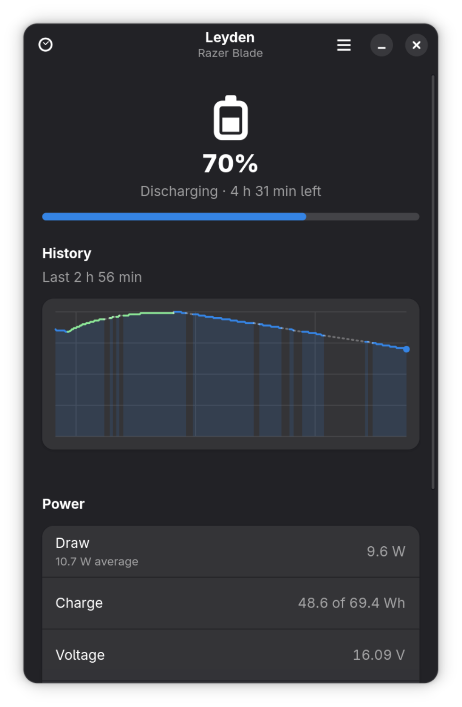

# Leyden

A small, native GNOME app that watches your laptop battery: state, capacity,
live power draw and intake, and how long a charge lasts.

Named after the [Leyden jar](https://en.wikipedia.org/wiki/Leyden_jar) (1745),
the first device that could store an electric charge.

Built with Rust, [relm4](https://relm4.org), GTK 4 and libadwaita — for one
laptop, running GNOME.

<p align="center">
  
</p>

## Status

Live battery state, charge, power, voltage, health and cycle count, read from
`/sys/class/power_supply`, plus a graph of the last 24 hours — green while
charging, accent while draining. History is kept in
`~/.local/share/leyden/history.tsv`, so the graph is already populated when you
open the window. Time estimates run on a smoothed power rate rather than a single
noisy reading.

Preferences (refresh interval, theme, time format, alerts, background) live in
`~/.config/leyden/settings.ini`. With **Keep running in the background** on,
closing the window keeps recording, so a long measurement is not interrupted;
relaunching brings the window back. Notifications at 20%, 10% and full charge need
the app installed — GNOME ignores notifications from an app it cannot resolve to
an installed `.desktop`.

## Install

```bash
make install     # builds release, installs to ~/.local — no sudo
```

Then launch **Leyden** from the app grid, or run `leyden`.

Requires GTK ≥ 4.20 and libadwaita ≥ 1.8. On Arch:

```bash
sudo pacman -S --needed base-devel pkgconf rust gtk4 libadwaita
```

## Development

```bash
cargo run
make check       # fmt + clippy -D warnings + test
```

## Licence

GPL-3.0-or-later. See [COPYING](COPYING).
